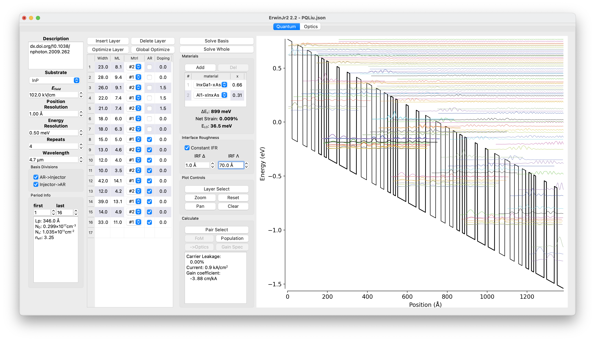

A software for Quantum Cascade Laser design and simulation
================

[](https://pypi.python.org/pypi/ErwinJr2)
[](https://erwinjr2.readthedocs.io/en/stable/?badge=latest)
[](https://github.com/ErwinJr2/ErwinJr2/actions/workflows/python-app.yml?query=branch%3Amaster)
[](https://github.com/ErwinJr2/ErwinJr2/actions/workflows/build-wheel.yml?query=branch%3Amaster)

dev:
[](https://github.com/ErwinJr2/ErwinJr2/actions/workflows/python-app.yml?query=branch%3Adev)
[](https://github.com/ErwinJr2/ErwinJr2/actions/workflows/build-wheel.yml?query=branch%3Adev)

This is a Quantum Cascade Laser (QCL) modeling and design software produced
at Princeton University, Gmachl group.

See https://erwinjr2.readthedocs.io/ for details.



In the following a simple installation guide is included. A more comprehensive
documents can be found [here](https://erwinjr2.readthedocs.io/)


Installation
---------------
The software is based on Python (>=3.9) and uses `setuptools` for installation.
The easiest way to install the software is via `pip` the Python package manager.

Fist to make sure you have the latest `pip` installed (depending on your
environment, `python` maybe `python3`):

```bash
python -m pip install pip --upgrade
```

Than install `ErwinJr2` by:

```bash
python -m pip install ErwinJr2
```

Now you can start the software via

```bash
ErwinJr
```

or if you want to, you can create a shortcut on the desktop via

```bash
ErwinJr-genshortcut
```

For reasonably new versions of Windows, MacOS with x86_64 CPU or Linux this
should work out of box. For other platform the compiled library may not work,
you may see `C library is not compiled. Features are limited.` warning if
that happens. In that case, refer to
[The Documents](https://erwinjr2.readthedocs.io/en/latest/manual/install.html)
for more detail about how to install it from source code and compile the
library locally.


## TODO list
- [X] OpenMP support
- [X] Add a linear algebra solver
- [ ] ?NEGF solver
- [X] upload to pip
- [X] register to OS
- [X] remove unnecessary C lib
- [X] Add IFR scattering
- [ ] Add impurity scattering (may be important for transport)
- [ ] Add finite temperature (to improve population distribution)
- [X] Add gain spectrum
- [X] global optimizer for QCLayers
- [X] optimizer for optical stratum
- [ ] save to excel (to growth sheet)
- [ ] Test case improve:
    - [ ] LO and IFR scattering results
    - [ ] Consistency with and without C lib
    - [ ] Electron population check
- [ ] Documents
    - [ ] make type hint consistent
- [ ] GUI indication of running computation
- [ ] EJcanvas.config to qt setting
- [X] plot style to global settings
- [X] Profile
- [X] Travis CI automatic testing
- [ ] upload to pip as a library
- [ ] ?coveralls.io
- [ ] ?codacy
- [ ] ?CFFI or SWIG
- [X] Provide binary
