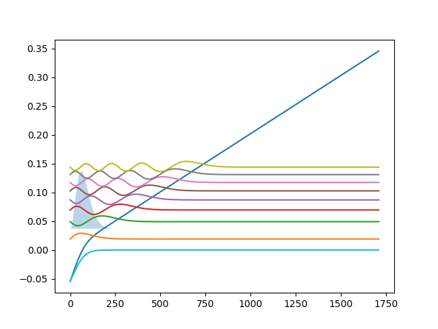

OneDQuantum.OneDMaxwell module
==============================

This module contains OneDMaxwell functions.
It is a Python interface for 1DMaxwell.c

.. automodule:: OneDQuantum.OneDMaxwell
   :members:

Example
-------
.. _example_maxwell:

Here is an example for how to use OneDMaxwell.py

.. figure:: figures/SelfConsistant.png

   Wavefunctions solved by simple Schrodinger equation, 
   with no electron-electron interaction correction.

   Wavefunctions solved with the electron-electron interaction correction.
   The wavefunctions have converged.

.. literalinclude:: ../OneDQuantum/example/SelfConsistant.py
   :language: python

