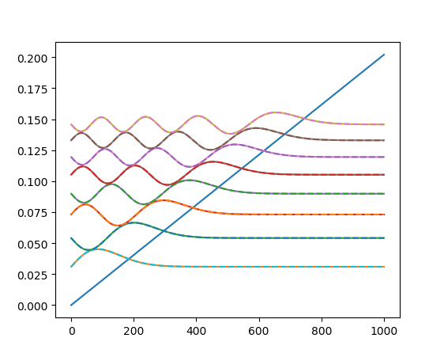

OneDQuantum.OneDSchrodinger module
==================================

This module contains OneDSchrodinger functions.
It is a Python interface of 1DSchrodinger.c

.. automodule:: OneDQuantum.OneDSchrodinger
   :members:

Example
-------
.. _example_schrodinger:

Here is an example for how to use OneDSchrodinger.py for 1D triangle well. 

   Output of SimpleSchrodinger.py

.. literalinclude:: ../OneDQuantum/example/SimpleSchrodinger.py
   :language: python

