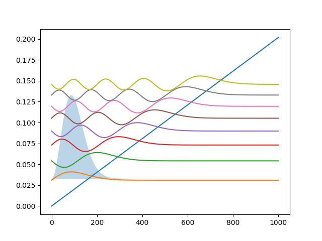

OneDThermal module
==================

This module contains OneDThermal functions.
It is a Python interface of 1DThermal.c

.. automodule:: OneDQuantum.OneDThermal
   :members:

Example
-------
.. _example_thermal:

Here is an example for how to use OneDThermal.py. 
The diagonal line is the potential of an 1D triangle well.
The wavefunctions are plotted in colors.
The electron density is solved using zero-temperature
Fermi-Dirac statistics, and plotted in blue.

   Output of Thermal.py

.. literalinclude:: ../OneDQuantum/example/Thermal.py
   :language: python

