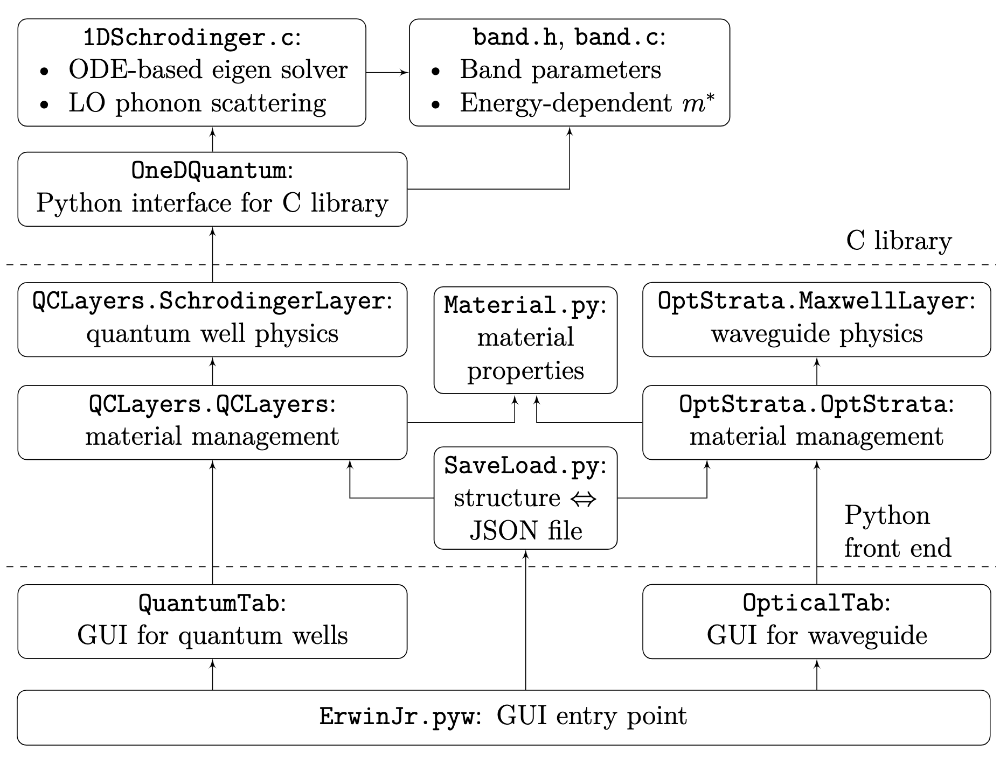

Code Structure
==============================

The basic structure of the software is:

The folder structure:

.. code-block:: none

    root
    |- ErwinJr2.....................The main souce code
    |  |- OneDQuantum...............The C library and its Python interface
    |  |  |- fftautocorr............A small FFT-based autocorrelation calculator
    |  |  |  |- ....
    |  |  |- docs...................The Doxygen documentation for the C library
    |  |  |- Makefile...............The build system for make
    |  |  |- OneDQuantum.sln........The build system for Visual Studio
    |  |  |- 1DSchrodinger.vcxproj..The build system for Visual Studio
    |  |  |- 1DSchrodinger.c
    |  |  |- band.c
    |  |  |- band.h
    |  |  |- science.h
    |  |  |- __init__.py
    |  |  |- OneDSchrodinger.py
    |  |  |- band.py
    |  |  |- typeDefs.py
    |  |- images....................The images needed for the GUI
    |  |  |- ....
    |  |- example....................Example files as QCL design
    |  |- __init__.py
    |  |- __main__.py...............This defines how ErwinJr will start outside command line
    |  |- OptStrata.py
    |  |- QCLayers.py
    |  |- Material.py
    |  |- rFittings.py
    |  |- SaveLoad.py
    |  |- QCPlotter.py
    |  |- ErwinJr.py
    |  |- QuantumTab.py
    |  |- OpticalTab.py
    |  |- EJcanvas.py
    |  |- customQTClass.py
    |  |- darkDetect.py
    |  |- versionAndName.py
    |  |- genshortcut.py
    |  |- Info.plist............The sample file for creating macOS shortcut
    |- test.....................Test cases
    |  |- ....
    |- docs.....................The documentation, as is shown online
    |  |- ....
    |- tool.....................Scripts to help developers, git negelets files starting by `p\_`
    |  |- ....
    |- CHANGELOG
    |- LICENSE
    |- README.md................This is shown in the project front page in GitHub
    |- pyproject.toml...........Part of the setup system required by PEP518
    |- setup.py.................The `setuptools` based setup system
    |- requirements.txt.........The requirement packages
    |- .readthedocs.yml.........The online documentation generation definition
    |- .travis.yml..............The automated test and deployment system definition
    |- .travis..................Scripts for online deployment
       |- ....

The C library in ``OneDQuantum`` has two sets of building system:
``make`` defined in ``Makefile`` and ``Visual Studio``
solution file defined in ``OneDQuantum.sln`` and
``1DSchrodinger.vcxproj``. They are intended to be consistent,
so that the software behaves the same under Linux/macOS and under Windows.

For the Python code, the project complies with the PEP8 code style,
and for the C code, the project complies K\&R style. For the version number,
we suggest the three-part version number convention:
[major version.minor version.patch]. For example, version 2.1.0 means major
version 2, minor version 1, and patch 0. Major version should increase when
there are large updates or a change of old APIs; minor version should increase
when there are new features; patch number increases when it's a bug fix.

