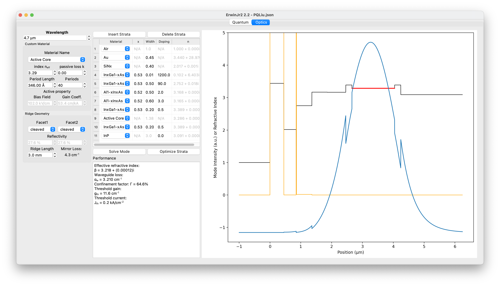

Graphical User Interface Guide
===================================
.. currentmodule:: ErwinJr2

The GUI starting program is defined in ``ErwinJr.py``, which includes two
tabs: the quantum tab and the optical tab.
The quantum tab is mostly a GUI wrapper of :py:class:`QCLayers` with a plotting canvas,
while the optical tab is for :py:class:`OptStrata`

Quantum Tab
------------

.. figure:: ../figures/qtab.png

   A screenshot of the ErwinJr.py quantum tab.

The interface includes 4 columns:

+---------------------+-----------------------------------------------------------+
|                 settingBox                                                      |
+=====================+===========================================================+
| Description         | Used as a comment, not for calculation                    |
+---------------------+-----------------------------------------------------------+
| Substrate           | Decide substrate, can influence strain and material set   |
+---------------------+-----------------------------------------------------------+
| E-field             | Global electrical field                                   |
+---------------------+-----------------------------------------------------------+
| Position resolution | Finite-element grid size                                  |
+---------------------+-----------------------------------------------------------+
| Energy resolution   | | Scan size for eigen solve root finder.                  |
|                     | | It only shows when the ODE solver is selected.          |
|                     | | This should be smaller than smallest energy difference. |
|                     | | If this is too small it's possible to lose some states  |
+---------------------+-----------------------------------------------------------+
| No of States        | | Determines the number of states to solve for.           |
| Per Period          | | It only shows when the matrix solver is selected.       |
|                     | | This should be large enough to cover the range of       |
|                     |   interest.                                               |
+---------------------+-----------------------------------------------------------+
| Repeats             | Number of the whole structure                             |
+---------------------+-----------------------------------------------------------+
| Wavelength          | The wavelength is used for optimization and for           |
|                     | calculating global gain                                   |
+---------------------+-----------------------------------------------------------+
| Basis Divisions     | Defined for basis solver.                                 |
|                     | See :py:meth:`QCLayers.solve_basis`                       |
+---------------------+-----------------------------------------------------------+
| Period info         | Calculate total length and doping density                 |
+---------------------+-----------------------------------------------------------+

+---------------------+-----------------------------------------------------------+
|                 layerBox                                                        |
+=====================+===========================================================+
| Layer Buttons       | Insert above layer and delete selected layer              |
+---------------------+-----------------------------------------------------------+
| Optimize Buttons    | Start optimizing.                                         |
|                     |                                                           |
|                     | - ``Optmize Layer`` only optimize the selected layer on   |
|                     |   the selected FoM;                                       |
|                     | - ``Global Optimize`` tries to optimize global gain.      |
|                     | - The feature is experimental.                            |
+---------------------+-----------------------------------------------------------+
| Layer Table         | Show the table that defines the layer structure           |
+---------------------+-----------------------------------------------------------+

+---------------------+-----------------------------------------------------------+
|                 solveBox                                                        |
+=====================+===========================================================+
| Solve basis button  | Call :py:meth:`QCLayers.solve_basis` and update plot      |
+---------------------+-----------------------------------------------------------+
| Solve whole button  | Call :py:meth:`QCLayers.solve_whole` and update plot      |
+---------------------+-----------------------------------------------------------+
| Material Table      | Define the material used in the structure                 |
+---------------------+-----------------------------------------------------------+
| Interface Roughness | The interface roughness :math:`\Delta` and :math:`\Lambda`|
|                     | See :py:meth:`QCLayers.ifr_transition` for detail.        |
|                     |                                                           |
|                     | - If `Constant IFR` is checked, all interfaces are having |
|                     |   the same IFR parameters                                 |
|                     | - If `Constant IFR` is not checked, IFR parameters are    |
|                     |   material dependent                                      |
|                     | - The material BEFORE the interface determines the IFR    |
+---------------------+-----------------------------------------------------------+
| Plot control        | - Layer Select: select layer in Layer Table by clicking   |
|                     | - Zoom: in with right button of mouse, out with left      |
|                     | - Pan: move with mouse                                    |
|                     | - Reset: make the plot back to default position           |
|                     | - Clear: remove all wavefunctions                         |
+---------------------+-----------------------------------------------------------+
| Calculation box     | - Pair Select: start to pick states by mouse              |
|                     | - FoM: calculating full information of the picked state   |
|                     |   pair                                                    |
|                     | - Population: calculating the steady state electron       |
|                     |   population in percentage                                |
|                     | - ->Optics: transport parameters to the ``Active Core``   |
|                     |   material in the Optical tab                             |
|                     | - Gain Spec: pop a new window showing the gain spectrum   |
+---------------------+-----------------------------------------------------------+

The plot canvas
~~~~~~~~~~~~~~~

The black lines (or blue line if a well is selected) are the conduction band
bottom or the potential.
The states are the colored curve but thick black if selected.
Other symmetry points in the band and the plot
style of the wavefunctions can be changed from ``View`` in the menu bar.
States that is thick in line is the selected set of a single period of states.
This selected set is used to calculate the electron population distribution.
States that are dashed lines are considered not well bounded.

Export of the figure and data, save and load actions are embedded into ``File`` menu;
temperature setting and advanced table settings are in ``Edit`` menu;
options to choose what is included in the plot is listed in ``View`` menu.

Optics Tab
-----------

   A screenshot of the ErwinJr.py quantum tab.

The interface includes 3 columns:

+---------------------+-----------------------------------------------------------+
|                 settingBox                                                      |
+=====================+===========================================================+
| Wavelength          | Can be transferred from quantum tab but not necessarily   |
|                     | the same                                                  |
+---------------------+-----------------------------------------------------------+
| Material Block      | Defines the customized material. For pure GUI user it     |
|                     | defines `Active Core` transferred from quantum tab        |
|                     |                                                           |
|                     | - index: the effective refractive index of the material   |
|                     | - passive loss: the loss that's not defined by gain below |
|                     | - Period Length and Periods: Determines the layer width   |
|                     |   of the `Active core`                                    |
+---------------------+-----------------------------------------------------------+
| Ridge Geometry      | Defines the ridge facet loss for threshold gain           |
|                     | calculation                                               |
|                     |                                                           |
|                     | - Reflectivity depends on the effective refractive index, |
|                     |   so the mirror loss will be updated after solved         |
+---------------------+-----------------------------------------------------------+

+---------------------+-----------------------------------------------------------+
|                 strataBox                                                       |
+=====================+===========================================================+
| The Strata Table    | Defines the waveguide structure.                          |
|                     |                                                           |
|                     | - At least an `Active Core` needs to be present.          |
|                     | - The first and the last layers are environment and       |
|                     |   substrate that is not meant to changed                  |
+---------------------+-----------------------------------------------------------+
| Solving Block       | | Solve for the first bounded mode and show its character |
|                     | | The optimizing is performed for lowest threshold,       |
|                     |   restricted on total width of selected layers in the pop |
|                     |   up window.                                              |
+---------------------+-----------------------------------------------------------+

The plot canvas
~~~~~~~~~~~~~~~

Black line and orange lines are the real and imaginary part of the refractive
index, respectively. The active core can be red based on the selection in
`View` menu.
